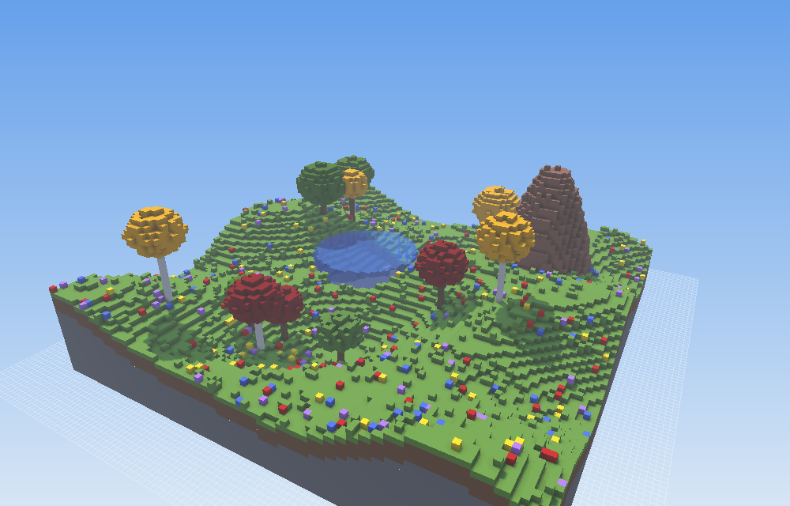
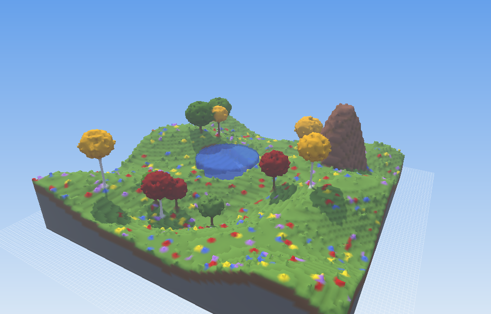
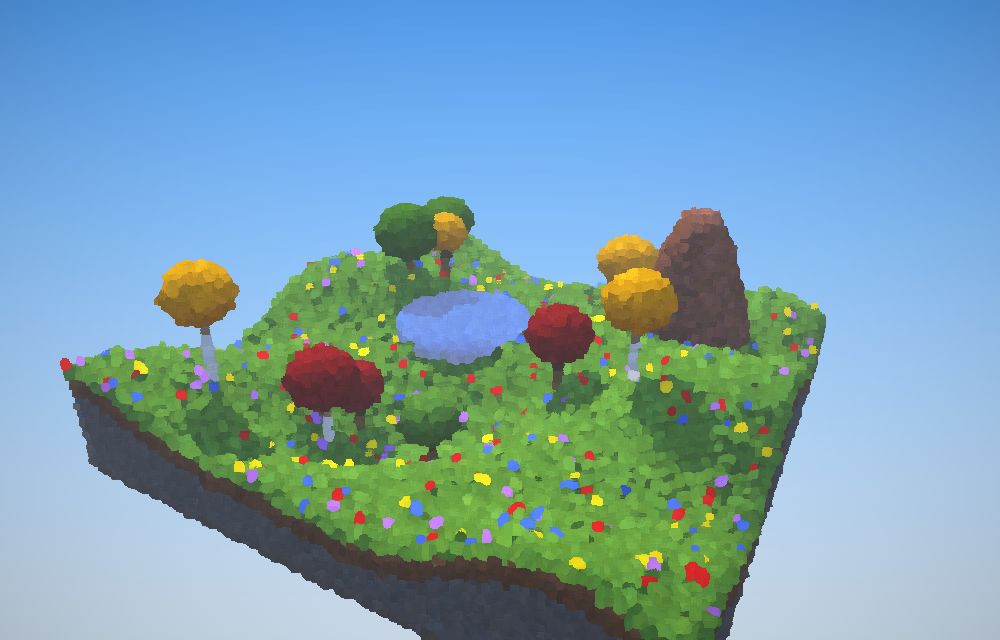
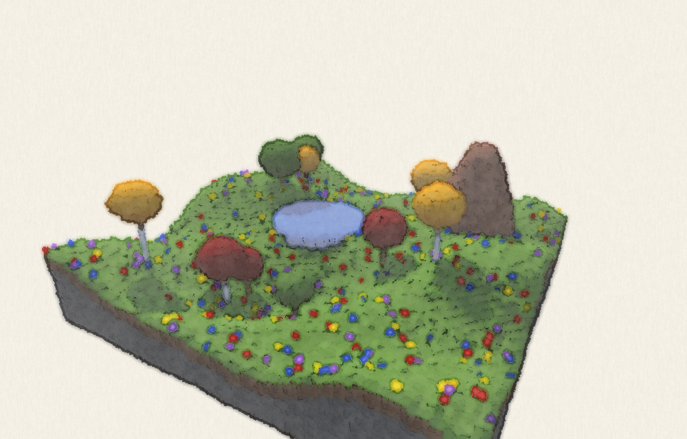

# voxel-viewer

A fast OpenGL voxel viewer for Linux and Android, written in C++17. It opens **MagicaVoxel**
models and **Minecraft WorldEdit** schematics.

The same scene in the four render modes (blocks, smooth, painted, watercolor), all under the
same light:






| Format | Extension | Notes |
|---|---|---|
| MagicaVoxel | `.vox` | Scene graph (`nTRN`/`nGRP`/`nSHP`) with rotations, hidden layers, custom palettes, glass and emissive materials |
| WorldEdit / Sponge schematic | `.schem` | Versions 1, 2 and 3. This is the format WorldEdit uses for 1.13+ |
| WorldEdit / MCEdit legacy schematic | `.schematic` | Numeric block IDs + data values, `AddBlocks`, Schematica mappings |
| Litematica | `.litematic` | All regions, including negative region sizes |
| Minecraft structure block | `.nbt` | Vanilla structure files |

The viewer detects the format from the file's content, so the extension doesn't matter.

## Rendering

- OpenGL 3.3 core (OpenGL ES 3.0 on Android). There are no dependencies beyond GLFW and zlib.
- **One lighting model for every mode**, so modes differ only in how they draw, not in how
  they're lit. All four share the same code: a warm sun with soft shadows from a 2048² shadow
  map rendered from that mode's own geometry (cubes, smooth mesh or dabs); cool sky light and
  ground bounce scaled by ambient occlusion; haze toward the horizon; and one tone curve. The
  scene sits under a sky gradient; `L` switches to a dark studio backdrop, `J` toggles
  shadows, and `O` toggles ambient occlusion.
- Voxels are stored sparsely in 32³ chunks. Chunks are meshed on all CPU cores using **greedy
  meshing** with per-vertex **ambient occlusion**. Each vertex is 8 bytes.
- **Smooth mode** (press `M`, or start with `--smooth`) uses a second mesher based on
  *constrained elastic surface nets*. It builds a surface over the voxel centers, then moves
  each vertex toward its neighbors a number of times while keeping it inside its own cell.
  Stair steps and hard edges become smooth curves with smooth normals. Features one voxel
  thick (walls, pillars, one-voxel holes) keep their thickness, because vertices must stay a
  margin away from the cell walls. `K` cycles the number of relaxation passes
  (0 = chamfered, 16 = smoothest). The mesh is watertight across chunk borders; a test checks
  this.
- **Painted mode** (press `P`, or start with `--painted`) draws every visible surface voxel as
  a short brush dab instead of a cube. Each dab has its own size, direction, value and color
  temperature, bristle streaks, and a slightly jittered position, so silhouettes break up
  like loose brushwork. A Kuwahara filter then merges the dabs into
  painterly patches of color while keeping edges crisp, and a final pass adds saturation,
  gentle contrast and a vignette. `tests/make_samples.py` writes a small `forest.schem`
  that shows it off.
- **Watercolor mode** (press `P` again, or start with `--watercolor`) doesn't draw cubes at all.
  Every visible surface voxel becomes a soft, irregular blob of pigment facing the camera,
  with its own size, rotation and amount of paint, painted on white paper. A full-screen pass then
  makes it look painted: edges wobble like a hand-drawn line, neighboring colors bleed into
  each other, pigment pools darker where washes meet, washes are uneven, and pigment settles
  into cold-press paper grain. It uses fewer resources than the mesh modes: 16 bytes per
  surface voxel.
- Chunks outside the view are skipped (frustum culling). Glass, water and ice are drawn in a
  separate alpha-blended pass, sorted back to front.
- Tested with a 768×76×768 Sponge schematic of 26.6 million voxels: it loads in about 0.75 s,
  meshes in about 0.2 s, and uses 33 MB of GPU memory. Smooth mode meshes the same map in
  about 2.3 s and uses 109 MB.
- Minecraft blocks are colored from a built-in table of average texture colors, covering
  about 400 blocks plus rules for dyed, wood, stone and copper variants. Unknown and modded
  blocks get a stable color derived from their name.

## Download

A prebuilt Linux x86_64 binary is on the [Releases page](https://github.com/nuxdie/voxel-viewer/releases/tag/latest).
It is rebuilt on every push to `master`, and GLFW is linked in, so you only need a GPU
driver (NVIDIA, Mesa, ...) and glibc 2.35 or newer.

```sh
curl -L https://github.com/nuxdie/voxel-viewer/releases/download/latest/voxel-viewer-linux-x86_64.tar.gz | tar xz
./voxel-viewer-linux-x86_64/voxel-viewer model.vox
```

### Android

`voxel-viewer-android.apk` is on the same [Releases page](https://github.com/nuxdie/voxel-viewer/releases/tag/latest).
Open it on the phone and allow installing from unknown sources. It needs Android 7.0 or newer
and OpenGL ES 3.0, which practically every phone since 2014 has. Builds are signed with the
same key every time, so a newer APK installs over the old one.

- **Open** opens the file picker, or loads one of the bundled samples (a forest and a house).
  You can also open `.vox`/`.schem` files from a file manager with "Open with → Voxel Viewer".
- **Mode** cycles Blocks → Smooth → Painted → Watercolor.
- **Slice − / Slice + / All** control the cut-away slice. **Decor** hides small blocks.
  **Reset** re-frames the model.
- Drag with one finger to orbit. Pinch to zoom, drag with two fingers to pan, and double
  tap to reset the view.

The app is in `android/`. It is a plain Gradle project with no library dependencies: a small
Java activity plus a JNI bridge (`android/app/src/main/cpp/jni_bridge.cpp`) to the same C++
engine. Build it with Android Studio, or run `gradle -p android assembleRelease` with the
Android SDK and NDK installed. The renderer uses OpenGL ES 3.0 there. You can run the same
path on desktop with `cmake -DVV_GLES=ON`, which is how it is tested without a phone.

## Building

```sh
# Debian / Ubuntu
sudo apt install build-essential cmake libglfw3-dev libgl-dev zlib1g-dev
# Fedora
sudo dnf install gcc-c++ cmake glfw-devel libglvnd-devel zlib-devel
# Arch
sudo pacman -S base-devel cmake glfw zlib

cmake -S . -B build -DCMAKE_BUILD_TYPE=Release
cmake --build build -j
./build/voxel-viewer path/to/model.vox
```

Optional: install with `sudo cmake --install build`. You can then run `ctest --test-dir build`
to run the loader tests, which need Python 3.

## NVIDIA GPUs

The viewer works with the proprietary NVIDIA driver (through libglvnd) and with nouveau/Mesa.
At startup it prints which GPU it is rendering on:

```
OpenGL 4.6.0 NVIDIA 570.xx on NVIDIA GeForce RTX 4070/PCIe/SSE2 (NVIDIA Corporation)
```

On a desktop where the NVIDIA card drives the display, the viewer just uses it. On
hybrid-graphics laptops (Intel/AMD iGPU + NVIDIA dGPU), the NVIDIA driver may be loaded while
the default context is on the integrated GPU. In that case the viewer restarts itself once with
**PRIME render offload** (`__NV_PRIME_RENDER_OFFLOAD=1 __GLX_VENDOR_LIBRARY_NAME=nvidia`).
To stay on the integrated GPU, pass `--no-prime`. You can also set the variables yourself, or
run `prime-run voxel-viewer ...`.

## Usage

```
voxel-viewer [options] [file...]

  --screenshot FILE.png  render the first file to a PNG and exit
  --size WxH             window / screenshot size (default 1600x1000)
  --angle YAW,PITCH      initial view angle in degrees (default 45,30)
  --zoom N               initial zoom in mouse-wheel steps (negative zooms out)
  --hide-decorations     hide torches, flowers, rails and other small blocks
  --smooth               start with the smooth mesher (toggle with M)
  --smooth-iterations N  smoothing passes, 0-16 (default 8)
  --painted              start in painted mode (P cycles painted / watercolor / off)
  --watercolor           start in watercolor-on-paper mode
  --no-ao                disable ambient occlusion
  --no-shadows           disable sun shadows
  --dark                 dark studio background instead of the sky
  --msaa N               multisample count (default 8, 0 to disable)
  --no-prime             do not request the NVIDIA GPU on hybrid-graphics laptops
```

To open files, pass them on the command line, **drag and drop** them onto the window, or press
**Ctrl+O** to get a file dialog (needs `zenity` or `kdialog`). When you open a single file,
`]` and `[` step through the other supported files in the same folder.

| Input | Action |
|---|---|
| Left drag | Orbit (fly mode: look around) |
| Right / middle drag | Pan |
| Mouse wheel | Zoom |
| `Tab` | Switch between orbit and fly camera |
| `W A S D`, `Q`/`E` (or `Ctrl`/`Space`), `Shift` | Fly: move, down/up, faster |
| `F` | Frame the model (reset view) |
| `1` `2` `3` `4` | Front / right / top / isometric view |
| `PgUp` / `PgDn` (+`Shift` for ×10) | Move the cut-away slice, to see inside buildings layer by layer |
| `Home` | Remove the slice |
| `M` | Switch between blocky cubes and the smooth mesh |
| `P` | Cycle painting modes: painted → watercolor on paper → off |
| `K` | Cycle smoothness (0, 2, 4, 8, 16 relaxation passes) |
| `V` | Show/hide small decorations (torches, flowers, rails, signs, ...) |
| `G` / `B` / `X` / `O` | Grid / bounding box / wireframe / ambient occlusion |
| `J` / `L` | Sun shadows on/off / sky or dark studio background |
| `F12` | Save a PNG screenshot to the current directory |
| `H` | Print help · `Esc` quits |

The window title shows the format, dimensions, voxel count and FPS.

`voxinfo` is a small command-line tool built alongside the viewer. It prints a file's
format, size, voxel count, mesh statistics and most common materials, without opening a
window.

## Project layout

```
src/voxel_model.h        sparse chunked voxel storage (Y-up)
src/nbt.*                NBT reader (gzip/zlib, bounds-checked)
src/vox_loader.cpp       MagicaVoxel .vox
src/schematic_loader.cpp .schematic / .schem / .litematic / structure .nbt
src/block_colors.*       Minecraft block colors + legacy numeric ID table
src/mesher.*             multithreaded greedy mesher with ambient occlusion
src/smooth_mesher.*      multithreaded smooth mesher (constrained surface nets)
src/splats.*             surface voxel splats for the painted and watercolor modes
src/renderer.*           OpenGL 3.3 / OpenGL ES 3.0 renderer
src/main.cpp             window, input, file handling (GLFW)
android/                 Android app (Java UI + JNI bridge to the same engine)
tests/make_samples.py    writes the same build in every format; check_samples.py cross-checks the loaders
```
